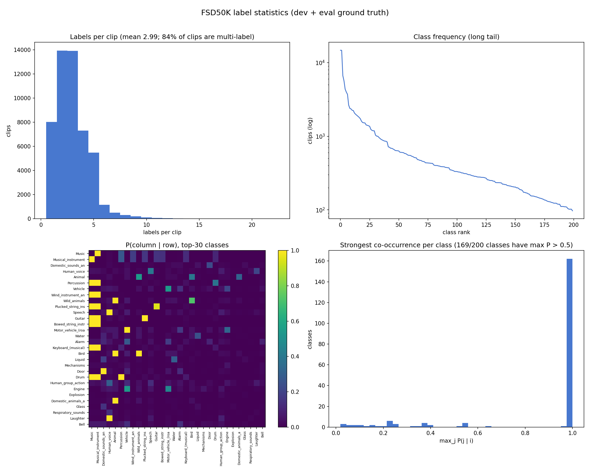

# ATGNN: Audio Tagging Graph Neural Network

Implementation of **ATGNN** ([paper, IEEE SPL 2023](https://arxiv.org/abs/2311.01526)),
a graph neural network for audio tagging. A CNN stem converts the log-mel
spectrogram into patch nodes, which are refined by **PGN** (Patch GNN) blocks —
a Pyramid [Vision GNN](https://github.com/huawei-noah/Efficient-AI-Backbones/tree/master/vig_pytorch)
encoder operating on a k-NN graph over spectrogram patches. Optional **MLG**
(Multi-Label GNN) blocks then model cross-modal structure:

- **PLG (Patch-Label GNN)**: learnable label embeddings connect to their nearest
  patch nodes and are updated with max-relative graph convolution.
- **LLG (Label-Label GNN)**: label embeddings are refined through a learnable
  adjacency matrix capturing latent label correlations.

The final score combines the patch logits (global pooling + conv head) with a
per-class readout of the refined label embeddings. Setting `model.net.use_mlg=False`
gives the encoder-only variant (denoted "-MLG" in the paper).

The training pipeline is built with PyTorch Lightning + Hydra and mirrors the
[Local-Higher-GNN](https://github.com/shubhrsingh22/Local-Higher-GNN) repository.

## Installation

```bash
conda create -n atgnn python=3.10 -y
conda activate atgnn
pip install torch==2.2.0 torchaudio==2.2.0 torchvision==0.17.0 --index-url https://download.pytorch.org/whl/cu118
pip install -r requirements.txt
```

## Data preparation (FSD50K)

Identical to Local-Higher-GNN: download [FSD50K](https://zenodo.org/records/4060432),
extract it so the root contains `dev_audio/`, `eval_audio/`, `ground_truth/`, then:

```bash
python data_prep/prep_fsd50k.py \
    --data_dir /path/to/FSD50K \
    --out_dir /path/to/experiments/hdf_fsd50k \
    --num_workers 32
```

## Pretrained encoder weights

The PGN encoder is initialised from ImageNet Pyramid ViG-S weights
([pvig_s_82.1.pth.tar](https://github.com/huawei-noah/Efficient-AI-Backbones/releases/tag/pyramid-vig)):

```bash
mkdir -p $EXP_DIR/pretrained
wget -P $EXP_DIR/pretrained https://github.com/huawei-noah/Efficient-AI-Backbones/releases/download/pyramid-vig/pvig_s_82.1.pth.tar
```

The 3-channel stem is averaged to 1 channel and the positional/relative embeddings
are bicubically interpolated from the 224x224 image grid to the 128x1024 mel grid.
MLG blocks and label embeddings are always trained from scratch. Set
`pretrained=null` to train everything from scratch.

## Training

```bash
export DATA_DIR=/path/to/FSD50K
export EXP_DIR=/path/to/experiments

# full ATGNN (PGN encoder + MLG blocks) on 4 GPUs
# fp32 + gradient clipping: the LLG adjacency multiplication is numerically
# unstable under fp16 mixed precision (loss goes NaN around epoch 6)
./run.sh trainer.precision=32 trainer.gradient_clip_val=1.0

# encoder-only variant (no MLG blocks) - stable in 16-mixed
./run.sh model.net.use_mlg=False task_name=train-fsd50k-encoder-only
```

Training follows the paper: Adam, LR 5e-4 with 1000-iteration linear warmup,
halved every 5 epochs after epoch 10, BCE loss, mixup 0.5, SpecAugment (48 freq /
192 time), 50 epochs. The best `val/mAP` checkpoint is evaluated on the FSD50K
eval set automatically after training.

## Results

Both variants trained on 4x NVIDIA L40S (DDP, batch 24 per GPU, effective 96),
PGN encoder initialised from ImageNet Pyramid ViG-S, 50 epochs. `eval mAP` is
the FSD50K evaluation set score of the best-validation checkpoint.

| Model | Params | Precision | best val mAP | eval mAP |
| ----- | ------ | --------- | ------------ | -------- |
| ATGNN-pyr-s, encoder only (-MLG) | 38.9M | 16-mixed | 0.597 | 0.575 |
| ATGNN-pyr-s, full (+MLG) | 47.5M | 32 | **0.601** | **0.580** |

For comparison, the paper (Table III) reports 0.583 eval mAP for ATGNN-pyr-s on
FSD50K, and its AudioSet-balanced ablation shows a similarly small MLG gain
(0.335 vs 0.331). [LHGNN](https://github.com/shubhrsingh22/Local-Higher-GNN)
trained from scratch with the same data pipeline reaches 0.535 eval mAP.

Notes from the runs:

- The MLG blocks add +0.005 eval mAP over the encoder alone, matching the
  paper's finding that most of the performance comes from the PGN encoder.
- The full model diverged (NaN loss at epoch 6) under fp16 mixed precision;
  the learnable label-label adjacency (`L_hat = A L + L`, applied at every
  stage without normalisation) amplifies activations beyond fp16 range.
  Training in fp32 with `gradient_clip_val=1.0` is stable end to end.
- ImageNet initialisation is highly effective: the encoder-only model reaches
  0.4 val mAP within 3 epochs.
- The parameter counts in the table above include the frozen relative-position
  tables; trainable parameters are 26.8M (encoder only) and 35.4M (full).

## Parameter count and walltime

Measured with `scripts/params_walltime.py` (single L40S, float32, no
JIT/torch.compile, batch 24 x 10 s clips of 1024x128 log-mel):

| Model | Trainable params (M) | Train step (ms) | Inference (ms/clip) |
|---|---|---|---|
| ATGNN-s encoder only (-MLG) | 26.8 | 258.0 | 5.08 |
| ATGNN-s full (+MLG) | 35.4 | 289.9 | 5.70 |
| LHGNN-s (same input/batch/GPU) | 31.1 | 643.2 | 14.52 |

The MLG blocks add ~12% to the training step time. Full environment details
are recorded in `results/params_walltime.md`; parameter count does not
directly translate to speed.

## Label co-occurrence analysis (why label graphs?)

`scripts/label_cooccurrence_fsd50k.py` quantifies the label structure that the
PLG/LLG blocks are designed to exploit, using the official FSD50K ground truth:

```bash
python scripts/label_cooccurrence_fsd50k.py \
    --gt_dir $DATA_DIR/ground_truth --out_dir results
```



Key numbers (dev + eval, 51,197 clips, 200 classes):

- **84.3% of clips are multi-label** (mean 2.99, median 3, max 22 labels per
  clip) — audio tagging on FSD50K is fundamentally a multi-label problem.
- **169 of 200 classes have a co-occurring label with conditional probability
  P(j|i) > 0.5**, largely reflecting the AudioSet ontology (e.g. every
  `Electric_guitar` clip is also `Guitar`/`Music`), plus non-hierarchical
  regularities (e.g. `Wild_animals` with `Bird`).
- The most frequent pairs: Music + Musical_instrument (14,703 clips),
  Musical_instrument + Percussion (3,977), Music + Percussion (3,977).

These strong, structured label correlations are exactly what the LLG block's
learnable adjacency can capture, and the per-class patch attachment of the PLG
block lets co-occurring labels bind to different regions of the same
spectrogram. Per-class frequencies and the top-100 pairs (with conditional
probabilities and normalised PMI) are written to `results/label_stats.csv`
and `results/top_label_pairs.csv`.

A plain-language walkthrough of this analysis (the figure explained panel by
panel and how it motivates the architecture) is available as a downloadable
PDF: [`examples/label_cooccurrence_explained.pdf`](examples/label_cooccurrence_explained.pdf).

## Citation

```
@article{singh2024atgnn,
  title={ATGNN: Audio Tagging Graph Neural Network},
  author={Singh, Shubhr and Steinmetz, Christian J. and Benetos, Emmanouil and Phan, Huy and Stowell, Dan},
  journal={IEEE Signal Processing Letters},
  year={2024}
}
```
